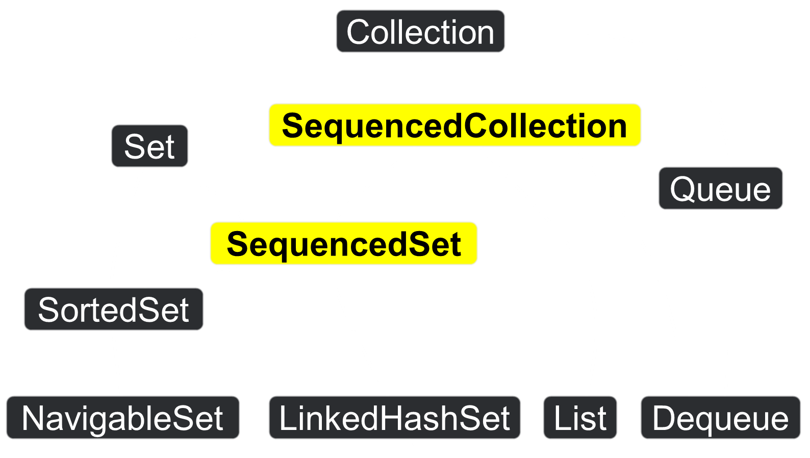
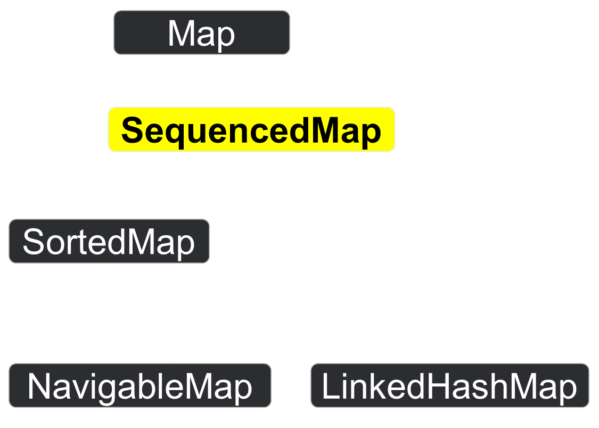

# Java's Blackjack and 21 on hand


*This repository contains examples of the important new features introduced in between Java 17 and Java 21.
Let's explore these features and how to switch between them using Git branches.*


## Java 17: what's ~~new~~ old features

### 🔡 JEP 378: ”””Text Blocks”””
The Java text block feature, introduced in Java 15 and later, allows you to create multi-line string literals in a more readable and efficient way. Here are the key points about text blocks:

#### Syntax:
Text blocks start with three double-quote marks (""") followed by optional whitespaces and a newline.
The content of the text block can span multiple lines without the need for explicit escape characters or concatenation.
#### Example:
```java
String cards = """
{
    "deck": "STANDARD",
    "cards": [
        {
            "rank": "TEN",
            "suit": "DIAMONDS"
        },
        {
            "rank": "KING",
            "suit": "SPADES"
        }
    ]
}
""";
```
#### Indentation Handling:
* Text blocks allow proper indentation.
* The compiler checks for the minimum indentation in all non-empty lines.
* The entire text block is shifted to the left based on this minimum indentation.
* The (base) indentation and the first newline are not included in the resulting String.
#### Escaping:
* Inside text blocks, double-quotes don’t need to be escaped.
* You can even use three double-quotes within a text block by escaping one of them.
* Text blocks are particularly useful for writing multi-line strings such as HTML, JSON, SQL queries, or any other structured text. They improve code readability and eliminate the need for manual line breaks and concatenation. 🌟📝
#### Branch
`git checkout java17/text-blocks`
#### Links
JEP 378: https://openjdk.org/jeps/378

### ⚕️JEP 406: Pattern matching for switch (Preview)
The Pattern Matching for switch feature, introduced in Java SE 17, enhances the Java programming language by allowing pattern matching for switch expressions and statements. This feature provides a more concise and readable syntax for checking the type of an object at runtime. Here are the key points:
#### Goals:
* Expand the expressiveness and applicability of switch expressions and statements by allowing patterns to appear in case labels.
* Relax the historical null-hostility of switch when desired.
* Introduce two new kinds of patterns: guarded patterns (to refine pattern matching logic with arbitrary boolean expressions) and parenthesized patterns (to resolve parsing ambiguities).
* Ensure that existing switch expressions and statements continue to compile with no changes and execute with identical semantics.
* Do not introduce a new switch-like construct separate from the traditional switch.
* Maintain consistent behavior regardless of whether case labels are patterns or traditional constants.
#### Motivation:
* Prior to this enhancement, switch statements were limited to exact equality tests against constants.
* With pattern matching, we can now test a variable against multiple possibilities, taking specific actions based on the matched pattern.
#### Example:
```java
  public static String getGameDescription17(CardGameType gameType) {
    return switch (gameType) {
      case POKER, BLACKJACK -> "Classic card games";
      case BRIDGE, RUMMY -> "Strategy card games";
      case SOLITAIRE, HEARTS, SPADES -> "Single-player card games";
      case EUCHRE, CANASTA, CRAZY_EIGHTS -> "Social card games";
      case GIN_RUMMY -> "Rummy variant";
      case WAR -> "Simple card battle game";
      case GO_FISH -> "Children's card game";
      case CASSINO, PINOCHLE -> "Trick-taking games";
      case CRIBBAGE -> "Unique scoring card game";
      case TRICK_TAKING, TRUMPS -> "General trick-taking games";
      default -> "Other card games";
    };
  }
```
#### Branch
`git checkout java17/switch`
#### Links
JEP 406: https://openjdk.org/jeps/406

### 📹 JEP 395: Record vs Lombok 🪄
When it comes to creating data classes in Java, both Java Records and Lombok offer solutions to reduce boilerplate code. However, they serve different purposes and have distinct features. Let’s explore their differences:

#### Java Records
##### Use Case
* Best suited for simple data transport objects, especially where immutability is desired.
* Designed as transparent carriers for immutable data.
* Ideal for scenarios where you need concise, read-only data structures.
##### Features
* Automatically generates essential methods like equals, hashCode, and toString.
* Concise syntax for defining data fields.
* Immutable by default.
* Well-suited for small, straightforward use-cases.
#### Example:
```java
public record DeckOfCardsRecord(
    int numberOfCards,
    boolean hasLogo,
    String brand,
    String color,
    boolean hasBox,
    int amountOfJokers
) { }
```
### Lombok
#### Use Case:
* More flexible, suitable for both mutable and immutable classes.
* Offers a wider range of features beyond what records provide.
* Allows customization of getter names, access levels, and return types.
#### Features:
* `@Value`: Creates immutable objects with minimal boilerplate.
* `@Getter`, `@Setter`: Customizable getter and setter methods.
* `@Builder`: Simplifies object creation with a fluent builder pattern.
* `@Data`: Combines `@Getter`, `@Setter`, `@EqualsAndHashCode`, and `@ToString`.
#### Example:
```java
@Value
@Builder
public class DeckOfCardsValue {
  int numberOfCards;
  boolean hasLogo;
  String brand;
  String color;
  boolean hasBox;
  int amountOfJokers;
}
```

### 👥JEP 394: Pattern Matching ...for instanceof
Pattern matching for instanceof is a Java 17 feature that allows you to test and assign an object to a variable of a specific type in one step. This feature simplifies the code and makes it more readable and robust. For example, instead of writing:
```java
if (obj instanceof DeckOfCardsValue) {
  DeckOfCardsValue deckOfCardsValue = (DeckOfCardsValue) obj;
  assertEquals(36, deckOfCardsValue.getNumberOfCards());
}
```
You can write:
```java
if (obj instanceof DeckOfCardsValue deckOfCardsValue) {
  assertEquals(36, deckOfCardsValue.getNumberOfCards());
}
```
#### Branch
`git checkout java17/pattern-matching`
#### Links
JEP 394: https://openjdk.org/jeps/394

### 👩‍👧‍👦JEP 409: Sealed classes… or final with exceptions
Sealed classes are a Java 17 feature that allows you to restrict which classes or interfaces can extend or implement a class or an interface. This feature enables more fine-grained inheritance control and supports future directions in pattern matching. For example, you can use sealed classes to model a fixed set of kinds of values in a domain, such as shapes or celestial objects.
To declare a sealed class or interface, you need to use the sealed modifier and specify the permitted subclasses or subinterfaces in the permits clause. For example:
```java
@Getter
@RequiredArgsConstructor
public abstract sealed class Card permits PlayingCard, UnoCard {
  private final String rank;
  public abstract String getDescription();
}
```
This means that only `PlayingCard` and `UnoCard` can extend `Card`. The permitted subclasses or subinterfaces must be declared in the same module or package as the sealed class or interface, and they must have one of the following modifiers:
* `final`: The class or interface cannot have any further subclasses or subinterfaces.
* `sealed`: The class or interface can have a restricted set of subclasses or subinterfaces, specified by its own permits clause.
* `non-sealed`: The class or interface can have any subclasses or subinterfaces, without any restrictions.
#### Branch
`git checkout java17/sealed`
#### Links
JEP 409: https://openjdk.org/jeps/409

### 🧵JEP 444 (Release): Virtual threads
Project Loom is an experimental feature of the Java platform that aims to improve the scalability and performance of concurrent applications. 
It introduces a new concept of **virtual threads**, also known as **fibers**, that are lightweight and managed by the JVM, rather than the operating system. 
Virtual threads can be created and suspended in large numbers, without consuming much memory or CPU resources. They also support blocking operations, such as I/O or synchronization, without blocking the underlying OS thread. This allows for a simpler and more expressive programming model, where concurrency can be achieved with plain Java code, rather than complex frameworks or libraries.
## Features
Some of the main features of Project Loom are:
- **VirtualThread** class: A new subclass of Thread that represents a virtual thread. It has the same API as the regular Thread class, but it can be created and started with much lower overhead. For example, `Thread.startVirtualThread(() -> task())` creates and runs a virtual thread that executes the given task.
- **Structured concurrency**: A new way of organizing concurrent code, where virtual threads are grouped into logical scopes that define their lifetime and dependencies. For example, `Thread.ofVirtual().start(task)` creates a virtual thread that is attached to the current scope, and will be automatically terminated when the scope ends. Structured concurrency helps to avoid common pitfalls, such as orphaned threads, resource leaks, or inconsistent state.
- **Continuation** class: A low-level abstraction that represents the state of a suspended computation. A continuation can be created, run, and yielded programmatically, allowing for finer control over the execution flow. For example, `Continuation.runWithContinuationScope(() -> task())` runs the given task in a new continuation scope, and returns a Continuation object that can be resumed later.
- **Tail-call elimination**: An optimization technique that prevents stack overflow errors when using recursive methods. Project Loom implements tail-call elimination for both regular and virtual threads, by reusing the same stack frame for the last call in a method. For example, `return factorial(n-1, n*acc)` is a tail call that does not consume additional stack space.
#### 🍃 Using virtual threads in Spring 
To turn on virtual threads in Spring, you need to have JDK 21 and Spring Boot 3.2 or higher. You also need to add the following property to your application.properties file:
`spring.threads.virtual.enabled=true`
This will enable virtual threads for your application, and Spring Boot will automatically switch to virtual threads for its concurrency utilities. 
Virtual threads are a preview feature of Java 19 that allow you to write scalable and performant concurrent applications with less complexity and overhead
#### Branch
`git checkout java21/loom`
#### Links
JEP 444: https://openjdk.org/jeps/444

### 📹👥 JEP 440: Record Patterns
#### Overview
JEP 440 introduces record patterns to the Java programming language, enhancing its data manipulation capabilities. This feature allows for the deconstruction of record values, facilitating more declarative and composable data navigation and processing.
#### Features
- **Deconstruction of Record Values**: Record patterns enable the decomposition of records into their constituent components.
- **Pattern Matching Enhancements**: Works in conjunction with `instanceof` and `switch` pattern matching, including support for guards.
- **Nested Patterns**: Allows for nested deconstruction, which is particularly useful with sealed record hierarchies.
## Motivation
The motivation behind JEP 440 is to extend pattern matching to destruct instances of record classes, enabling sophisticated data queries and more composable data queries.
## Example Usage
```java
void recordPatternsJava21Test() {
  Card card1 = new PlayingCard("Jack", "Hearts");
  Card card2 = new PlayingCard("Ace", "Spades");

  Object playerHand = new PlayerHand(card1, card2);
  if (playerHand instanceof PlayerHand(PlayingCard c1, PlayingCard c2)) {
    System.out.println("First card: " + c1);
    System.out.println("Second card: " + c2);
    if (getValue(c1) + getValue(c2) == 21) {
      System.out.println("Blackjack!");
    } else {
      System.out.println("Total hand value: " + (getValue(c1) + getValue(c2)));
    }
  }
}
```
#### Branch
`git checkout java21/record-patterns`
#### Links
JEP 440: https://openjdk.org/jeps/440

### ⚕️JEP 441: Pattern Matching for Switch
#### Overview
**Pattern Matching for Switch** is a significant enhancement introduced in **Java 21**. It revolutionizes the way we handle switch statements, making code selection more straightforward and expressive. Here's what you need to know:
- Pattern Matching for Switch allows us to use **patterns in case labels** within switch statements.
- It improves code readability, reduces redundancy, and simplifies complex switch blocks.
#### Features
- In earlier Java releases, the selector expression in a switch statement had limitations:
    - It had to evaluate to a number, string, or enum constant.
    - Case labels had to be constants.
- With this new feature:
    - The selector expression can be **any reference type or an int type** (excluding long, float, double, or boolean).
    - Case labels can now have **patterns**, offering more flexibility.
    - We can test whether the selector expression matches a pattern, rather than being exactly equal to a constant.
#### Example: Calculating card value
- Consider the following code that calculates blackjack card's value:
  ```java
  public sealed interface Card permits UnoCard, PlayingCard {
    String getRank();
  }
  
  public record CardPair<T extends Card>(T first, T second) { }
  
  private static int cardValue(Card card) {
    return switch (card) {
      case UnoCard unoCard when isInteger(unoCard.getRank()) -> parseInt(unoCard.getRank());
      case UnoCard unoCard when !isInteger(unoCard.getRank()) ->
          10; // face cards are worth 10 points
      case PlayingCard playingCard when isInteger(playingCard.getRank()) ->
          parseInt(playingCard.getRank());
      case PlayingCard playingCard when "Ace".equals(playingCard.getRank()) -> 1;
      case PlayingCard playingCard when Set.of("Jack", "Queen", "King")
          .contains(playingCard.getRank()) -> 10;
      case null -> 0;
      default -> throw new IllegalArgumentException("Unknown card type: " + card);
    };
  }
  ```
    - In this example, we use a **pattern switch expression** to handle different card types.
    - The code is more concise and expressive compared to the traditional switch statement.
#### Record Patterns
 - Record patterns also became a final feature in Java 21 and are supported in switch.
 - For instance:
   ```java
    public static int pointsInPair(CardPair<Card> cardPair) {
    return switch (cardPair) {
      case CardPair<Card>(PlayingCard f, PlayingCard s) -> {
        System.out.println("Playing cards! First one: " + f + " Second one: " + s);
        yield cardValue(f) + cardValue(s);
      }
      case CardPair<Card>(UnoCard f, UnoCard s) -> {
        System.out.println("Uno cards! First one: " + f + " Second one: " + s);
        yield cardValue(f) + cardValue(s);
      }
      default -> throw new IllegalArgumentException("Unknown card type: " + cardPair);
    };
   }
   ```
#### Branch
`git checkout java21/switch-patterns`
#### Links
JEP 441: https://openjdk.org/jeps/441

### 📶 JEP 431: Sequenced Collections
**JEP 431** introduces new interfaces to the Java Collections Framework to represent collections with a defined encounter order. 
This enhancement addresses the lack of a unified collection type that represents a sequence of elements and provides uniform APIs for accessing elements in both forward and reverse order.

#### Key Features:
- **SequencedCollection Interface**: A collection with a well-defined first, second, and subsequent elements, supporting operations at either end.
- **Reversed Views**: The `reversed()` method offers a reverse-ordered view, allowing for processing elements from last to first.
- **Enhanced Set and Map Interfaces**: `SequencedSet` and `SequencedMap` interfaces extend the standard `Set` and `Map` with sequenced behavior.
- **Retrofitting**: Existing classes like `List`, `Deque`, `LinkedHashSet`, `SortedSet`, `LinkedHashMap`, and `SortedMap` are retrofitted to implement these new interfaces.
#### Motivation:
The motivation behind JEP 431 is to fill the gaps in Java’s collections framework where a collection type representing a sequence of elements with a defined encounter order was missing]. 
This led to inconsistencies and limitations in expressing certain concepts and performing operations related to encounter order.
#### Impact:
JEP 431 simplifies working with collections that have an encounter order, making it easier to write clear and efficient code when dealing with sequences of elements.
```java

```
#### Branch
`git checkout java21/switch-patterns`
#### Links
JEP 431: https://openjdk.org/jeps/431


